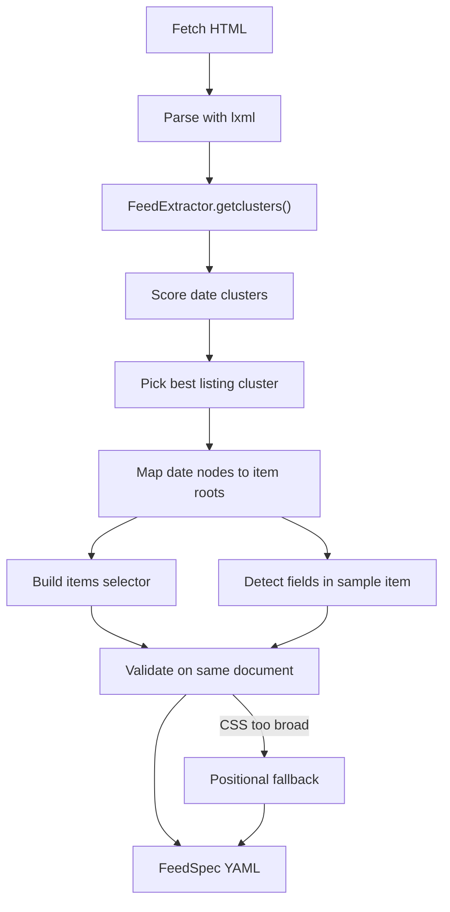

# Parsing spec format

A **parsing spec** (YAML) captures how to extract a news feed from a fixed page layout: where repeating news items live, and how to read date, title, link, description, and image from each item.

The `analyze` CLI command runs newsworker's dynamic heuristics once and **distils** them into this portable spec. Later runs use `extract --spec` (or a matching site bridge) to apply deterministic selectors instead of re-running discovery — much faster on repeat crawls of the same site.

Implementation: `newsworker/spec.py` (`FeedSpec`, `SpecAnalyzer`, `SpecExtractor`).

## Quick start

```bash
# Generate a spec from a live news listing page
newsworker analyze "https://example.com/news" -o example.yaml

# Reuse the spec for fast extraction
newsworker extract "https://example.com/news" -s example.yaml -f rss
```

The same YAML shape is used inside **site bridges** (`newsworker/bridges/*.yaml`, `~/.newsworker/bridges/`) under a top-level `spec:` key.

---

## How `analyze` works

`newsworker analyze URL` loads settings, fetches the page, and calls `SpecAnalyzer.analyze(..., require_items=True)`. The analyzer does not invent selectors from scratch — it **records** what the dynamic `FeedExtractor` pipeline would have chosen.



### Step-by-step

1. **Fetch and parse** — HTML is decoded and parsed into an lxml tree (`SpecAnalyzer._parse`).

2. **Find date clusters** — `FeedExtractor.getclusters()` scans short text nodes (under `filtered_text_length`, default 150 characters), keeps nodes that look date-like, and matches them against qddate patterns. Consecutive dates at the same DOM depth that share a parent container are grouped into a **cluster** keyed by that container's absolute XPath.

3. **Pick the best cluster** — Each cluster is scored (`_cluster_score`) by:
   - number of items with a link and title (sampled from up to six item roots);
   - total date count;
   - bonus if the container has CSS classes matching `NEWS_CLASSES_KEYWORDS`.

   Clusters inside `<select>`, `<form>`, and similar UI controls are rejected so callback time-slot forms do not beat real news lists.

4. **Item roots** — For each date node in the winning cluster, the analyzer walks up to the **direct child** of the cluster container (`snode`). That element is one news **item root**. Tables normalize through `<tbody>` when present.

5. **Items rule** — The analyzer tries to emit a semantic CSS selector:
   - prefer a `tag.class` shared by all item roots (ignoring WordPress `category-*`, `tag-*`, and `post-<id>` classes);
   - else the most frequent per-item CSS selector;
   - else a **positional fallback**: `selector: "./*"`, `selector_type: xpath`, plus an inferred `stride` when items are separated by spacer nodes.

   A CSS selector is kept only if it matches at least ~90% of discovered items (minimum 2) and is not overly broad (bare `div` matching hundreds of nodes is rejected).

6. **Field rules** — From one representative item root, heuristics locate:
   - **date** — the known date node; relative selector via CSS or XPath;
   - **title** — first heading (`h1`–`h4`) with text length > 10, else first long text/tail;
   - **description** — next long text block after title;
   - **link** — first `<a href>`;
   - **image** — first ``.

   **Date patterns** — qddate pattern keys seen in the cluster (e.g. `dt:date:date_9`) are stored on the date field. If HTML `<time datetime="...">` was matched, the special marker `html:time` is included and `source` becomes `attr:datetime`.

7. **Language** — Taken from `<html lang>`, `Content-Language`, config override, or text samples from item titles (`resolve_feed_language`).

8. **Validation** — Before returning (when `require_items=True`, as in the CLI):
   - built selectors must match **at least two** item scopes;
   - at least **title or link** rules must exist;
   - dates must parse from the first few matched items.

   If semantic CSS validation fails, the analyzer retries with the positional items rule.

### CLI behaviour

| Aspect | Behaviour |
|--------|-----------|
| Success | Writes YAML to `--output` / `-o`, or prints to stdout |
| Failure | Exits code 1 with `SpecAnalysisError` message (no news listing, no field rules, selectors too weak, dates not parseable) |
| Fetch options | Same as `extract`: `--user-agent`, `--proxy`, `--timeout`, `--header`, `--cookies`, `--insecure`, `--ignore-robots`, `--language`, `--config` |

Programmatic use:

```python
from newsworker.spec import SpecAnalyzer

spec = SpecAnalyzer(filtered_text_length=150).analyze(
    "https://example.com/news",
    require_items=True,  # match CLI strictness
)
spec.save("example.yaml")
```

---

## YAML structure

Top-level keys (in typical emission order):

| Key | Type | Description |
|-----|------|-------------|
| `version` | int | Spec schema version. Current: `1`. |
| `source` | object | Provenance of the analysis run. |
| `feed` | object | Feed-level metadata applied during extraction. |
| `items` | object | How to locate repeating item elements. |
| `fields` | object | Named extraction rules (`date`, `title`, `link`, …). |

Optional sections may be omitted when they match defaults (e.g. `stride: 1`).

### Example (from `tests/fixtures/news_list.html`)

```yaml
version: 1
source:
  url: https://example.com/news
  analyzed_at: '2026-07-05T18:01:32'
feed:
  title: Example News Portal
  language: en
items:
  selector_type: css
  selector: li.news-item
  container: /html/body/main/ul
fields:
  date:
    selector: span.date
    source: text
    patterns:
    - dt:date:date_9
    required: true
  title:
    selector: a
    source: text
  description:
    selector: p
    source: text
  link:
    selector: a
    source: attr:href
    absolute: true
```

### `source`

| Field | Description |
|-------|-------------|
| `url` | Page URL passed to `analyze`. Used as the feed link and base for relative URLs. |
| `analyzed_at` | ISO 8601 timestamp (local, seconds precision) when the spec was built. Informational only. |

### `feed`

| Field | Description |
|-------|-------------|
| `title` | Feed title. Defaults to `<head><title>` or `"News from {url}"`. |
| `language` | BCP 47-ish language code (e.g. `en`, `fr`). Used in RSS/Atom output; may be refined at extract time from item text if not overridden in settings. |

---

## `items` — locating news entries

Each **item scope** is one or more DOM nodes that together represent a single news entry.

| Field | Default | Description |
|-------|---------|-------------|
| `selector_type` | `css` | Hint: `css` or `xpath`. Runtime auto-detects: strings starting with `.` or `/` are XPath. |
| `selector` | `./*` | Selector **relative to each matched container** (or document root if no container). Empty string means the scope node itself. |
| `container` | — | Absolute XPath to the listing wrapper (the cluster `snode`). When set, `selector` runs inside the first matching container. |
| `stride` | `1` | For positional layouts: take every Nth node from the selector result. Values > 1 group consecutive nodes into one scope (multi-node items). |

**Semantic strategy (preferred):** `selector_type: css` with something like `li.news-item` or `article.fusion-post-grid`.

**Positional fallback:** when class-based selectors are ambiguous:

```yaml
items:
  selector_type: xpath
  selector: ./*
  container: /html/body/main/div[1]
  stride: 2
```

---

## `fields` — per-item extraction

Each field is a map of optional rules. Standard names used by the analyzer:

| Field | Typical role |
|-------|----------------|
| `date` | Publication date (usually `required: true`) |
| `title` | Headline |
| `description` | Summary or body snippet |
| `link` | Canonical item URL |
| `image` | Thumbnail or hero image URL |

### Field rule properties

| Property | Default | Description |
|----------|---------|-------------|
| `selector` | `""` | Selector **relative to the item scope root**. Empty string = the scope element itself. |
| `source` | `text` | Where to read the value (see below). |
| `absolute` | `false` | If true, resolve the value as an absolute URL against the page URL (`link`, `image`). |
| `patterns` | — | **Date only:** list of qddate pattern keys discovered during analysis, plus optional `html:time`. Restricts date parsing to these patterns at extract time. |
| `required` | `false` | **Date only:** if true, items without a parseable date are dropped. |

### `source` values

| Value | Reads |
|-------|--------|
| `text` | Element's direct text node (`node.text`) |
| `tail` | Text after the element (`node.tail`) — common when the date is bold inline before a link |
| `content` | Full visible text (`text_content()`) — used for headings |
| `attr:href` | Attribute (any name after `attr:`), e.g. `attr:datetime`, `attr:src` |

### Date patterns

- **qddate keys** — Strings like `dt:date:date_9` identify which regex patterns `SpecExtractor` loads for that site. The analyzer copies keys from matched nodes in the listing cluster.
- **`html:time`** — Not a qddate pattern. Marks that dates come from `<time>` elements; extraction uses `FeedExtractor.match_date` and/or `parse_datetime_attr` on `datetime` attributes. When present on `<time datetime="...">`, analysis sets `source: attr:datetime`.

Items without a parseable date are skipped when `date.required: true` (the default from `analyze`).

---

## Selector convention

All selector strings (`items.selector`, `items.container`, `fields.*.selector`) follow one rule:

| Form | Interpretation |
|------|----------------|
| `""` | The scope element itself |
| Starts with `.` or `/` | XPath (relative or absolute) |
| Anything else | CSS selector (lxml `cssselect`) |

Field selectors are **relative to each item scope**. The items `container` is typically an **absolute** XPath from the document root (as emitted by lxml's `getpath`).

**CSS vs XPath preference during analysis:** `relative_selector()` tries a unique `tag.class` CSS path first (including `parent child` compounds), then falls back to positional XPath like `./div[1]/a[1]`.

---

## Applying a spec

`SpecExtractor.extract(url, spec)`:

1. Parses the page.
2. Resolves `items.container` → runs `items.selector` → applies `stride` → list of item scopes.
3. For each scope, extracts fields via `_extract_value` (first non-empty match in the scope).
4. Parses dates with pattern-restricted qddate session or HTML time handling.
5. Builds the internal feed dict (`title`, `language`, `items[]` with `pubdate`, `link`, `unique_id`, `raw_html`, `extra.links`, `extra.images`).

Same spec is loaded by:

- `newsworker extract --spec path.yaml`
- `FeedService` when a spec path or bridge is configured
- Site bridges when URL matches `match.host` / `match.path`

---

## Manual edits and troubleshooting

**Safe to edit**

- Tighten `items.selector` if the analyzer matched too many nodes.
- Point `fields.*.selector` at more stable classes.
- Set `feed.language` or add/remove optional fields (`image`, `description`).

**After layout changes**

- Re-run `analyze` on the listing page, or diff and patch selectors.
- If extraction returns fewer items than expected, check whether `container` still points at the listing wrapper.

**Common analyzer outcomes**

| Situation | Typical spec shape |
|-----------|-------------------|
| Clean semantic list | `selector: li.news-item`, class-based field selectors |
| Unclassed wrappers | `selector: ./*`, `selector_type: xpath`, non-1 `stride` |
| WordPress grids | `article.<theme-class>`; taxonomy classes stripped from item selector |
| `<time datetime>` | `patterns: [html:time]`, `source: attr:datetime` |

**Strict CLI errors**

| Message | Meaning |
|---------|---------|
| `No dated news listings detected` | No date clusters on the page |
| `Could not group them into individual news items` | Dates found but item roots could not be derived |
| `Could not derive title or link extraction rules` | Item structure too minimal for heuristics |
| `matched fewer than 2 news items` | Selectors do not reproduce the discovered listing |
| `could not parse dates` | Date selectors or patterns fail on sample items |

For pages without a news listing, use dynamic extraction (`extract` without `--spec`) or a hand-written bridge spec.

---

## Related reading

- User CLI overview: [`analyze`](/commands/analyze)
- Site bridges example: [`newsworker/bridges/example.com.yaml`](https://github.com/ivbeg/newsworker/blob/master/newsworker/bridges/example.com.yaml)
- Module docstring and API: `newsworker/spec.py`
- Tests: `tests/test_spec.py`
